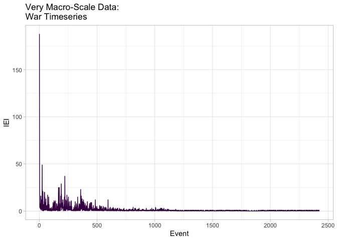
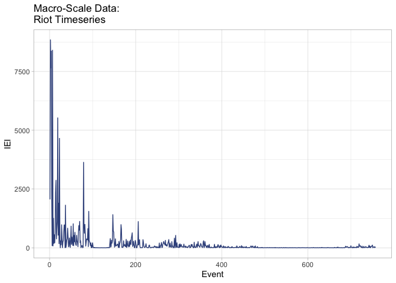
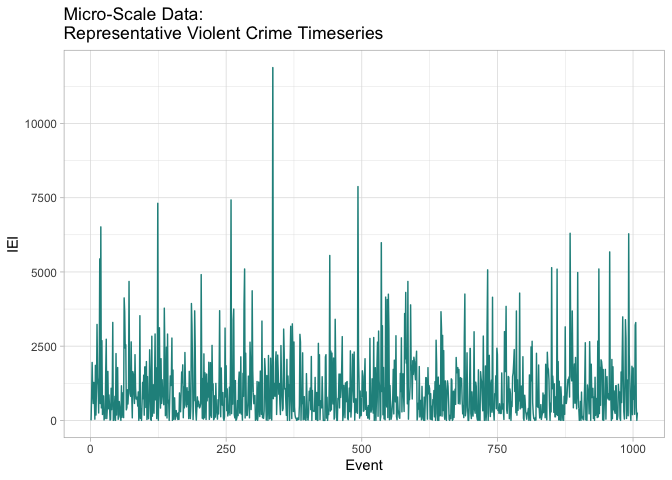
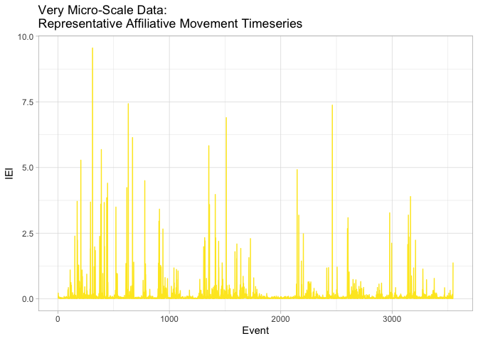
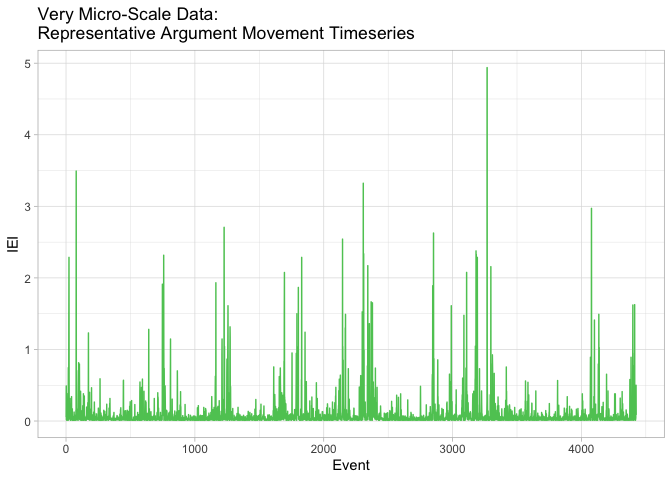
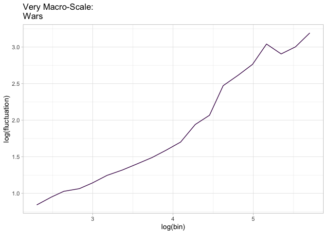
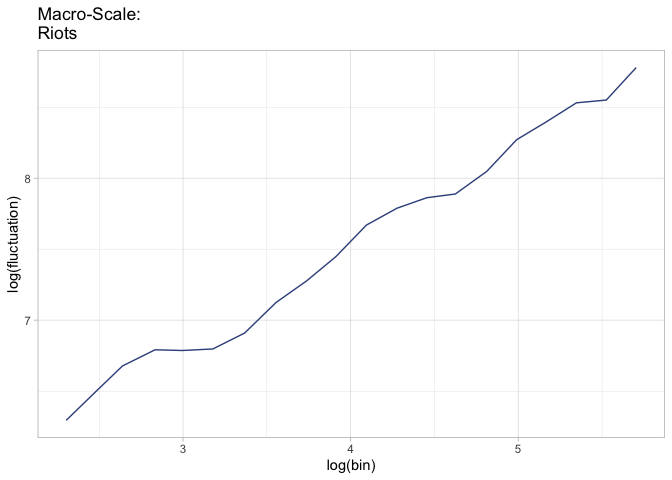
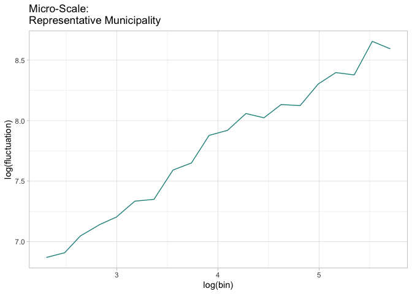
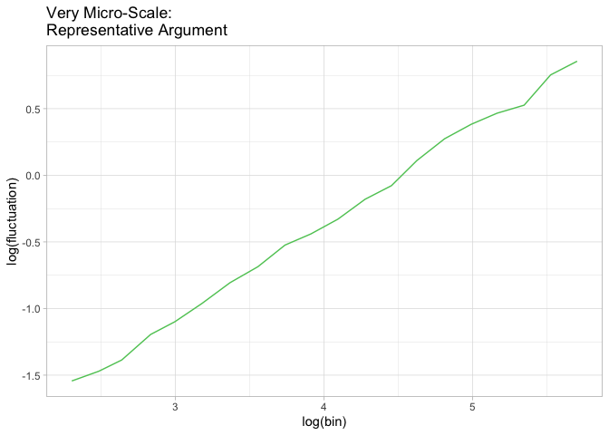

This R markdown creates figures for our project investigating the fractal
structure of conflict from international to interpersonal levels (Blau & Paxton,
in press, *Complexity*).

To run this from scratch, you will need the following files:

* `./data/wars-iei.csv`: File containing inter-war-interval data.
* `./data/riots-iei.csv`: File containing inter-riot-intervals data.
* `./data/crime_data/appleton-ici.csv`: File containing inter-crime-interval data 
(violent crime only) for Appleton, WI.
* `./data/prepped_data-DCC.csv`: File with raw movement data derived from head-mounted 
accelerometers. Data were originally collected as part of Paxton and Dale 
(2017, *Frontiers in Psychology*). Data are freely available in the OSF repository for 
the original project (https://osf.io/x9ay6/) and are linked in the OSF repository
for the current project (https://osf.io/wtgp4/).

**Code written by**: A. Paxton (University of Connecticut)

**Date last modified**: 04 November 2020

***

# Preliminaries


```r
# clear things out
rm(list=ls())

# load in the required packages
library(tidyverse)
library(ggplot2)
library(viridis)
library(cowplot)
library(nonlinearTseries)
```

## Load data


```r
# load in the riot data
riot_data = read.table('./data/riots-iei.csv',
                       sep=',', header=FALSE) %>%
  rename(IEI = V1) %>%
  rownames_to_column("Event") %>%
  mutate(Event = as.numeric(Event))

# load in the war data
war_data = read.table('./data/wars-iei.csv',
                      sep=',', header=FALSE) %>%
  rename(IEI = V1) %>%
  rownames_to_column("Event") %>%
  mutate(Event = as.numeric(Event))

# load in the crime data
crime_data = read.table('./data/crime_data/appleton-ici.csv',
                        sep=',', header=FALSE) %>%
  rename(IEI = V1) %>%
  rownames_to_column("Event") %>%
  mutate(Event = as.numeric(Event))

# load in affiliative movement data
affiliative_movement_data = read.table('./data/movement_data/threshold-partic_1_dyad_11_type_0.csv',
                                       sep=',', header=TRUE) %>%
  
  # calculate IEI
  mutate(IEI = t - lag(t)) %>%
  drop_na() %>%
  
  # create event counter
  rownames_to_column("Event") %>%
  mutate(Event = as.numeric(Event))

# load in argumentative movement data
argumentative_movement_data = read.table('./data/movement_data/threshold-partic_1_dyad_16_type_1.csv',
                                         sep=',', header=TRUE) %>%
  
  # calculate IEI
  mutate(IEI = t - lag(t)) %>%
  drop_na() %>%
  
  # create event counter
  rownames_to_column("Event") %>%
  mutate(Event = as.numeric(Event))
```

## Specify global plotting parameters


```r
# get total palette
total_palette = viridis(5)

# specify each event type
affiliative_color = total_palette[5]
argumentative_color = total_palette[4]
crime_color = total_palette[3]
riot_color = total_palette[2]
war_color = total_palette[1]

# specify mean H values
affiliative_H_value = .637
argumentative_H_value = .722
crime_H_value = .534
riot_H_value = .741
war_H_value = .743
```

***

# Plot timescales


```r
# plot the war timeseries
war_ts = ggplot(war_data, aes(y = IEI,
                              x = Event)) +
  geom_path(color=war_color) +
  theme_light() +
  ggtitle(paste0("Very Macro-Scale Data:\n",
                 "War Timeseries"))

# display here
war_ts
```

<!-- -->


```r
# plot the riot timeseries
riot_ts = ggplot(riot_data, aes(y = IEI,
                                x = Event)) +
  geom_path(color=riot_color) +
  theme_light() +
  ggtitle(paste0("Macro-Scale Data:\n",
                 "Riot Timeseries"))

# display here
riot_ts
```

<!-- -->


```r
# plot the crime timeseries
crime_ts = ggplot(crime_data, aes(y = IEI,
                                  x = Event)) +
  geom_path(color=crime_color) +
  theme_light() +
  ggtitle(paste0("Micro-Scale Data:\n",
                 "Representative Violent Crime Timeseries"))


# display here
crime_ts
```

<!-- -->


```r
# plot the movement timeseries
affiliative_ts = ggplot(affiliative_movement_data, aes(y = IEI,
                                                       x = Event)) +
  geom_path(color=affiliative_color) +
  theme_light() +
  ggtitle(paste0("Very Micro-Scale Data:\n",
                 "Representative Affiliative Movement Timeseries"))

# display here
affiliative_ts
```

<!-- -->


```r
# plot the movement timeseries
argument_ts = ggplot(argumentative_movement_data, aes(y = IEI,
                                                      x = Event)) +
  geom_path(color=argumentative_color) +
  theme_light()  +
  ggtitle(paste0("Very Micro-Scale Data:\n",
                 "Representative Argument Movement Timeseries"))


# display here
argument_ts
```

<!-- -->


```r
# create stacked plot visualization
stacked_ts = cowplot::plot_grid(war_ts,
                                riot_ts,
                                crime_ts,
                                argument_ts,
                                affiliative_ts,
                                nrow=5,
                                rel_widths=c(1))

# save it
save_plot(filename='./figures/soa-stacked_ts_figure.jpg',
          plot=stacked_ts,
          base_height = 9,
          base_width = 7,
          dpi = 300)
```

***

# Plot DFA plots


```r
# calculate war DFA and convert to usable dataframe
war_dfa = nonlinearTseries::dfa(war_data$IEI,
                                do.plot=FALSE)
war_dfa_df = data.frame(bin = war_dfa$window.sizes,
                        fluctuation = war_dfa$fluctuation.function)

# plot with ggplot
war_dfa_plot = ggplot(war_dfa_df, aes(y = log(fluctuation),
                                      x = log(bin))) +
  geom_path(color = war_color) +
  theme_light() +
  ggtitle(paste0("Very Macro-Scale:\nWars"))

# show here
war_dfa_plot
```

<!-- -->


```r
# calculate riot DFA and convert to usable dataframe
riot_dfa = nonlinearTseries::dfa(riot_data$IEI,
                                 do.plot=FALSE)
riot_dfa_df = data.frame(bin = riot_dfa$window.sizes,
                         fluctuation = riot_dfa$fluctuation.function)

# plot with ggplot
riot_dfa_plot = ggplot(riot_dfa_df, aes(y = log(fluctuation),
                                        x = log(bin))) +
  geom_path(color = riot_color) +
  theme_light() +
  ggtitle(paste0("Macro-Scale:\nRiots"))

# show here
riot_dfa_plot
```

<!-- -->


```r
# calculate crime DFA and convert to usable dataframe
crime_dfa = nonlinearTseries::dfa(crime_data$IEI,
                                  do.plot=FALSE)
crime_dfa_df = data.frame(bin = crime_dfa$window.sizes,
                          fluctuation = crime_dfa$fluctuation.function)

# plot with ggplot
crime_dfa_plot = ggplot(crime_dfa_df, aes(y = log(fluctuation),
                                          x = log(bin))) +
  geom_path(color = crime_color) +
  theme_light() +
  ggtitle(paste0("Micro-Scale:\nRepresentative Municipality"))

# show here
crime_dfa_plot
```

<!-- -->


```r
# calculate affiliative DFA and convert to usable dataframe
affiliative_dfa = nonlinearTseries::dfa(affiliative_movement_data$IEI,
                                        do.plot=FALSE)
affiliative_dfa_df = data.frame(bin = affiliative_dfa$window.sizes,
                                fluctuation = affiliative_dfa$fluctuation.function)

# plot with ggplot
affiliative_dfa_plot = ggplot(affiliative_dfa_df, aes(y = log(fluctuation),
                                                      x = log(bin))) +
  geom_path(color = affiliative_color) +
  theme_light() +
  ggtitle(paste0("Very Micro-Scale:\nRepresentative Affiliative"))

# show here
affiliative_dfa_plot
```

<!-- -->


```r
# calculate argument DFA and convert to usable dataframe
argument_dfa = nonlinearTseries::dfa(argumentative_movement_data$IEI,
                                     do.plot=FALSE)
argument_dfa_df = data.frame(bin = argument_dfa$window.sizes,
                             fluctuation = argument_dfa$fluctuation.function)

# plot with ggplot
argument_dfa_plot = ggplot(argument_dfa_df, aes(y = log(fluctuation),
                                                x = log(bin))) +
  geom_path(color = argumentative_color) +
  theme_light() +
  ggtitle(paste0("Very Micro-Scale:\nRepresentative Argument"))

# show here
argument_dfa_plot
```

<!-- -->


```r
# create stacked plot visualization
stacked_dfa_plot = cowplot::plot_grid(war_dfa_plot,
                                      riot_dfa_plot,
                                      crime_dfa_plot,
                                      affiliative_dfa_plot,
                                      argument_dfa_plot,
                                      nrow=5,
                                      rel_widths=c(1))

# save it
save_plot(filename='./figures/soa-stacked_dfa_figure.jpg',
          plot=stacked_dfa_plot,
          base_height = 9,
          base_width = 2.8,
          dpi = 300)
```
